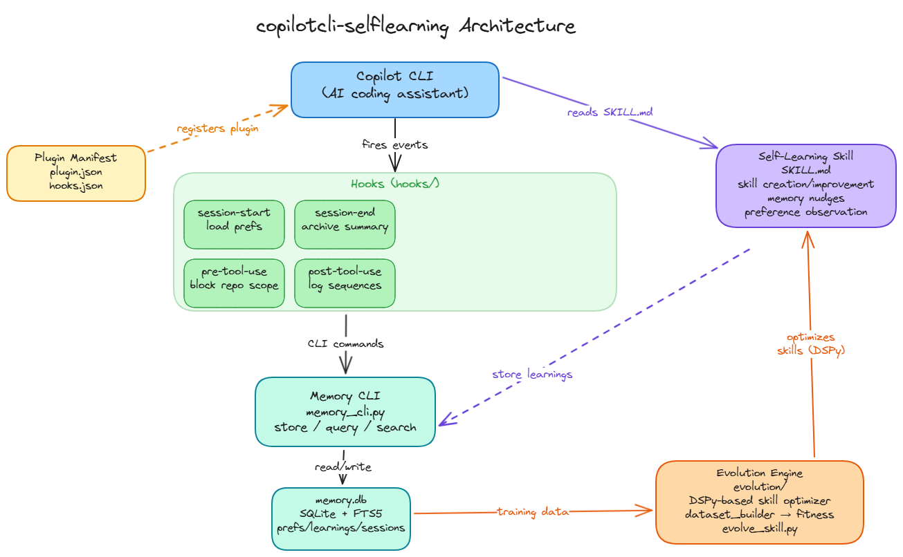

# Architecture

Developer reference for the self-learning system internals.

For user-facing setup, see [README.md](README.md).
For LLM skill instructions, see [skills/self-learning/SKILL.md](skills/self-learning/SKILL.md).

## System Overview

## Database Schema

All data lives in `~/.copilot/self-learning/memory.db` (SQLite, WAL mode).

### preferences

User workflow and style preferences with confidence scoring and supersede chain.

| Column | Type | Notes |
|--------|------|-------|
| id | INTEGER PK | Auto-increment |
| category | TEXT NOT NULL | e.g. "code-style", "workflow", "tool-preferences" |
| fact | TEXT NOT NULL | The preference statement |
| confidence | REAL | 0.0–1.0, default 0.7 |
| source | TEXT | Where this was observed |
| created_at | TEXT | ISO datetime |
| updated_at | TEXT | ISO datetime |
| superseded_by | INTEGER FK | Points to newer preference (self-referential) |

**Supersede chain**: When a preference is updated, the old row gets `superseded_by` set
to the new row's id. Queries filter `WHERE superseded_by IS NULL` to get active prefs.

### personal_memory

Facts, conventions, gotchas, and commands discovered during sessions.

| Column | Type | Notes |
|--------|------|-------|
| id | INTEGER PK | Auto-increment |
| subject | TEXT NOT NULL | Topic key (e.g. "build-system", "auth") |
| fact | TEXT NOT NULL | The memory content |
| citations | TEXT | Source references |
| repo | TEXT | owner/repo if repo-specific |
| session_id | TEXT | Which session discovered this |
| created_at | TEXT | ISO datetime |

### skill_usage

Tracks skill invocations and outcomes. Fed by `postToolUse` hook (success/failure)
and manual `log-skill` calls (partial/skipped).

| Column | Type | Notes |
|--------|------|-------|
| id | INTEGER PK | Auto-increment |
| skill_name | TEXT NOT NULL | Skill identifier |
| repo | TEXT | Context repo |
| session_id | TEXT | Session that used the skill |
| outcome | TEXT | CHECK: success, partial, failure, skipped |
| friction_notes | TEXT | What went wrong (manual only) |
| created_at | TEXT | ISO datetime |

**Note**: Hook-sourced entries only have `success`/`failure` outcomes.
`partial` and `skipped` require manual `log-skill` invocation.

### learning_log

Session workflows flagged as potential skill auto-creation candidates.

| Column | Type | Notes |
|--------|------|-------|
| id | INTEGER PK | Auto-increment |
| repo | TEXT | Context repo |
| session_id | TEXT | Source session |
| intent | TEXT | What the user was trying to do |
| workflow_phases | TEXT | Comma-separated phases |
| tool_count | INTEGER | Number of tool calls |
| skill_candidate | INTEGER | 1 if flagged as candidate |
| created_at | TEXT | ISO datetime |

### Cross-session search (native store)

Session transcripts are stored in Copilot CLI's native `~/.copilot/session-store.db`.
This is a separate SQLite database managed by Copilot CLI itself — the self-learning
system reads it in read-only mode for cross-session search and evolution data mining.

**Native store schema** (read-only, managed by Copilot CLI):
- `sessions` — id, repository, branch, summary, created_at, updated_at
- `turns` — session_id, turn_index, user_message, assistant_response, timestamp
- `search_index` — FTS5 virtual table (content, session_id, source_type)
- `checkpoints`, `session_files`, `session_refs` — additional metadata

**FTS5 query syntax**: `keywords` (AND), `word1 OR word2`, `"exact phrase"`,
`prefix*`, `word1 NOT word2`.

**Note**: The native FTS5 store uses the default tokenizer (not porter). Hyphens
in queries are treated as column prefix operators — the search command automatically
wraps hyphenated terms in double-quotes to avoid errors.

### tool_usage

Every tool invocation per session, for sequence pattern analysis.

| Column | Type | Notes |
|--------|------|-------|
| id | INTEGER PK | Auto-increment |
| session_id | TEXT NOT NULL | Session identifier |
| tool_name | TEXT NOT NULL | e.g. "grep", "edit", "bash", "skill" |
| seq_index | INTEGER NOT NULL | 0-based order within session |
| success | INTEGER | 1 = success (default), 0 = failure |
| created_at | TEXT | ISO datetime |

**Pattern detection**: Use `query-tool-sequences --patterns --window-size 3`
to find recurring n-gram tool sequences across sessions. Sequences appearing
in 2+ sessions are potential skill candidates.

## Hooks

All hooks live in `hooks/` with bash + PowerShell variants. They resolve
`memory_cli.py` relative to their own location (`dirname $0/../resources/`)
so they work from any install path.

| Hook | Event | Behavior |
|------|-------|----------|
| pre-tool-use | preToolUse | Blocks `store_memory` (returns deny) — **only hook with actionable output** |
| session-start | sessionStart | Logging only (output is **ignored** by Copilot CLI runtime) |
| post-tool-use | postToolUse | Logs tool to tool_usage + skill to skill_usage (output ignored) |

> **Important**: Per the [official docs](https://docs.github.com/en/copilot/reference/hooks-configuration),
> only `preToolUse` can return actionable output (allow/deny). All other hooks
> have their output discarded. Preference loading is handled via custom
> instructions in `~/.copilot/copilot-instructions.md`, not hooks.

## Evolution Engine

See [evolution/README.md](evolution/README.md) for the DSPy + GEPA optimization
framework. Key design decisions:

- **GEPA optimizes CoT reasoning**, not skill text directly. The skill body is
  passed as an InputField on each forward pass; the evolution loop in
  `evolve_skill.py` handles skill text mutation between optimization runs.
- **Fitness metric** uses bag-of-words overlap (with stopword filtering) as a
  fast proxy during optimization. Full LLM-as-judge scoring is used on the
  holdout set.
- **Three eval data sources**: synthetic (LLM-generated), sessiondb (mined from
  Copilot CLI's native session-store.db via FTS5), golden (hand-curated JSONL).
